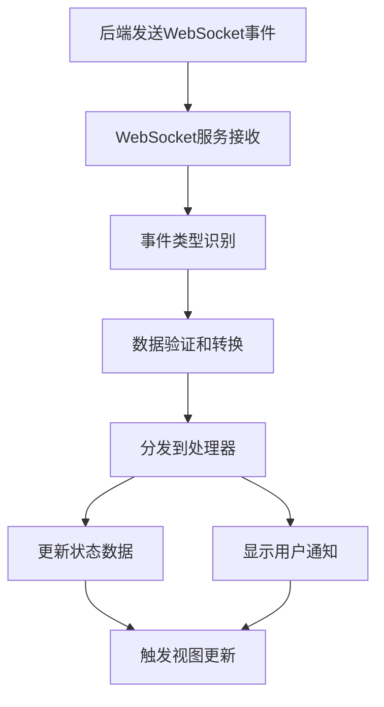

# WebSocket事件功能实现文档

## 项目信息

| 项目 | 内容 |
|------|------|
| 文档名称 | WebSocket事件功能实现文档 |
| 版本 | V1.0.0 |
| 更新时间 | 2025-01-27 |
| 状态 | 已完成 |

## 概述

根据后端API文档中的事件通知章节，我们已经完成了前端对所有新增WebSocket事件类型的支持。本文档详细说明了实现的功能和技术细节。

## 新增功能

### 1. 支持的WebSocket事件类型

我们现在支持以下14种新的WebSocket事件类型：

#### 核心消息事件
- **message_received** - 即时消息通知
- **conversation_created** - 会话创建通知
- **user_online** - 用户上线通知
- **user_offline** - 用户下线通知

#### 广播和自定义事件
- **broadcast_received** - 广播通知
- **custom_event** - 自定义事件通知

#### 会话管理事件
- **member_left** - 退出会话通知
- **conversation_name_updated** - 会话名称修改通知
- **member_added** - 添加成员通知
- **member_removed** - 移除成员通知
- **conversation_dissolved** - 群组解散通知
- **owner_transferred** - 群主转让通知

#### 系统功能事件
- **watermark_updated** - 水印修改通知
- **location_updated** - 位置上报通知

### 2. 技术架构

#### 类型定义系统 (`src/types/chat.ts`)
```typescript
// 为每个事件类型定义了完整的接口
export interface MessageReceivedEvent {
  message_id: number;
  conversation_id: number;
  sender_id: number;
  content: string;
  message_type: MessageType;
  created_at: string;
  sender_name: string;
  sender_standard_id: string;
}

// ... 其他13个事件接口
```

#### WebSocket服务增强 (`src/services/websocket.ts`)
- **双格式支持**: 支持新的API格式 (`event + data`) 和旧格式 (`type + payload`)
- **事件路由**: 自动识别事件类型并分发到正确的处理器
- **类型安全**: 使用TypeScript的严格类型检查确保事件数据正确性
- **错误处理**: 完善的错误日志和异常处理

```typescript
// 支持两种消息格式
const eventType = data.event || data.type;
const eventData = data.data || data.payload;

switch (eventType) {
  case 'message_received':
    this.emitter.emit('message_received', eventData);
    break;
  // ... 处理其他事件类型
}
```

#### 状态管理优化 (`src/stores/chat.ts`)
- **数据处理**: Store专注于数据状态管理，不处理UI通知
- **实时同步**: 自动更新本地数据状态以反映服务器变化
- **缓存管理**: 智能的消息和会话缓存策略

#### 通知管理系统 (`src/components/chat/NotificationManager.vue`)
- **独立组件**: 专门处理所有通知显示逻辑
- **智能通知**: 根据事件优先级和类型显示不同样式的通知
- **用户体验**: 优化的通知时间和位置，避免干扰用户操作

### 3. 功能特性

#### 智能通知分类
- **高优先级**: 群组解散、系统广播等重要事件，使用醒目的错误样式
- **中优先级**: 用户上下线、成员变更等，使用警告样式
- **低优先级**: 水印更新、位置更新等，使用信息样式

#### 自动状态同步
- **会话列表**: 自动更新会话名称、成员数量等信息
- **在线状态**: 实时同步用户在线/离线状态
- **消息状态**: 自动处理消息投递、已读状态

#### 用户界面集成
- **Element Plus**: 使用Element Plus的通知组件保持UI一致性
- **响应式**: 支持不同屏幕尺寸的通知显示
- **无侵入**: 通知不会阻塞用户的正常操作

## 实现细节

### 1. 事件处理流程



### 2. 代码组织

```
src/
├── types/chat.ts              # 事件类型定义
├── services/websocket.ts      # WebSocket服务
├── stores/chat.ts             # 状态管理
├── components/chat/
│   └── NotificationManager.vue # 通知管理
└── views/ChatView.vue         # 主视图集成
```

### 3. 错误处理

- **连接异常**: 自动重连机制
- **事件解析**: 捕获并记录解析错误
- **状态不一致**: 自动刷新机制
- **通知失败**: 降级处理，不影响核心功能

## 测试验证

### 1. 功能测试要点

- [ ] 所有14种事件类型正确接收和处理
- [ ] 通知显示样式和时机正确
- [ ] 状态数据实时同步
- [ ] 错误场景的降级处理
- [ ] 性能表现（大量事件处理）

### 2. 兼容性测试

- [ ] 旧版本事件格式兼容性
- [ ] 不同浏览器WebSocket支持
- [ ] 移动端响应式适配
- [ ] 网络不稳定场景

## 配置和部署

### 1. 环境变量

```bash
# WebSocket服务地址
VITE_WS_BASE_URL=ws://172.19.103.122:8000
```

### 2. 依赖要求

- Vue 3.x
- Element Plus 2.x
- TypeScript 5.x
- Mitt (事件总线)

## 使用指南

### 1. 基本使用

系统会自动处理所有WebSocket事件，开发者无需额外配置。只需确保：

1. 在主视图中包含 `NotificationManager` 组件
2. WebSocket连接正常建立
3. 用户已正确登录

```vue
<template>
  <div class="app">
    <!-- 其他内容 -->
    <NotificationManager />
  </div>
</template>
```

### 2. 自定义通知

如需自定义通知行为，可以修改 `NotificationManager.vue` 中的处理器：

```typescript
// 自定义消息通知
handleMessageReceived: (data: MessageReceivedEvent) => {
  // 自定义逻辑
  ElNotification({
    title: `来自 ${data.sender_name} 的消息`,
    message: data.content,
    type: 'info',
    duration: 5000,
    position: 'bottom-right'
  });
}
```

## 性能优化

### 1. 事件处理优化

- **防抖处理**: 频繁事件的防抖处理
- **批量更新**: 多个相关事件的批量状态更新
- **内存管理**: 及时清理过期的事件监听器

### 2. UI优化

- **虚拟化**: 大量通知时的虚拟滚动
- **动画优化**: CSS动画硬件加速
- **资源管理**: 图片和媒体资源的懒加载

## 监控和调试

### 1. 日志系统

所有事件处理都有详细的控制台日志：

```javascript
console.log('📩 收到即时消息通知:', data);
console.log('🆕 收到会话创建通知:', data);
// ... 其他事件日志
```

### 2. 调试工具

- **Vue DevTools**: 查看状态变化
- **Network面板**: 监控WebSocket连接
- **Console**: 查看事件处理日志

## 后续开发计划

### 1. 功能增强

- [ ] 通知声音支持
- [ ] 桌面通知权限管理
- [ ] 通知历史记录
- [ ] 个性化通知设置

### 2. 性能优化

- [ ] 事件缓存机制
- [ ] 离线事件队列
- [ ] 智能重连策略

## 总结

本次实现完成了对后端API文档中所有WebSocket事件类型的支持，建立了完整的事件处理架构，提供了良好的用户体验和开发者体验。系统具有良好的扩展性和可维护性，为未来的功能扩展奠定了坚实基础。

---

**更新记录**:
- 2025-01-27: 初始版本，完成所有14种事件类型支持 